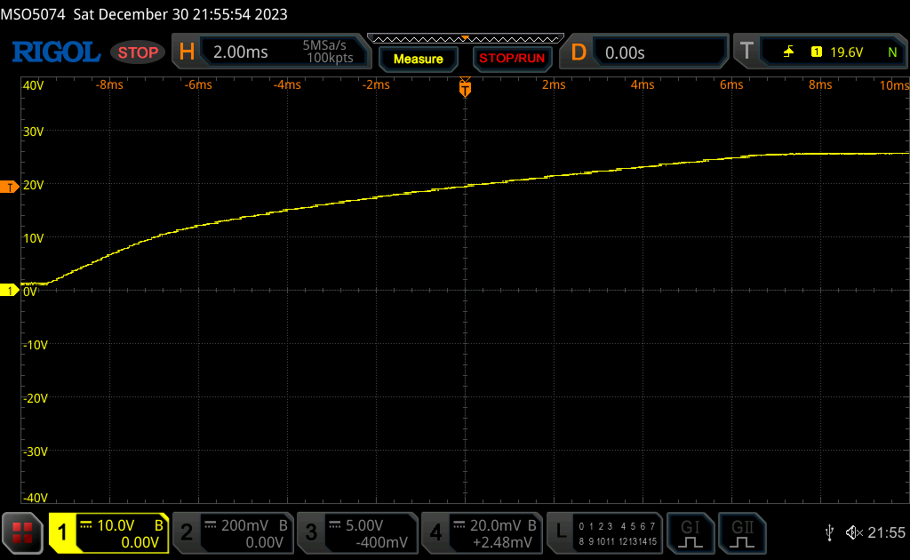
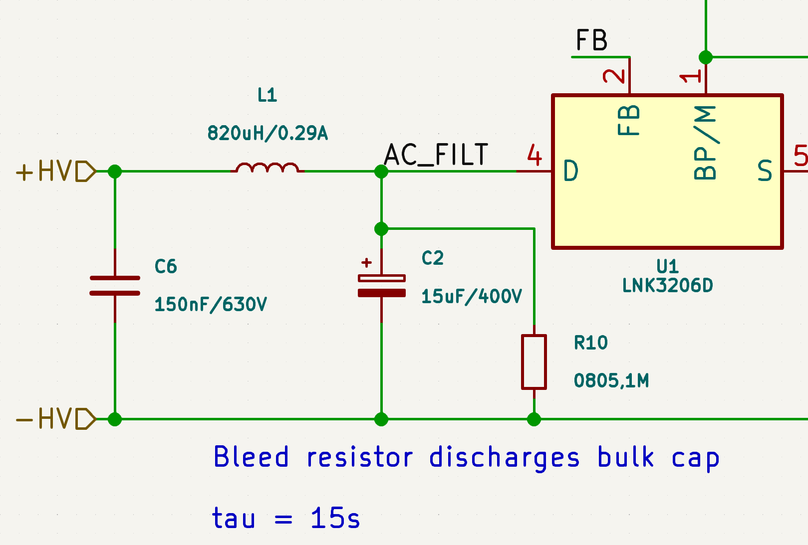
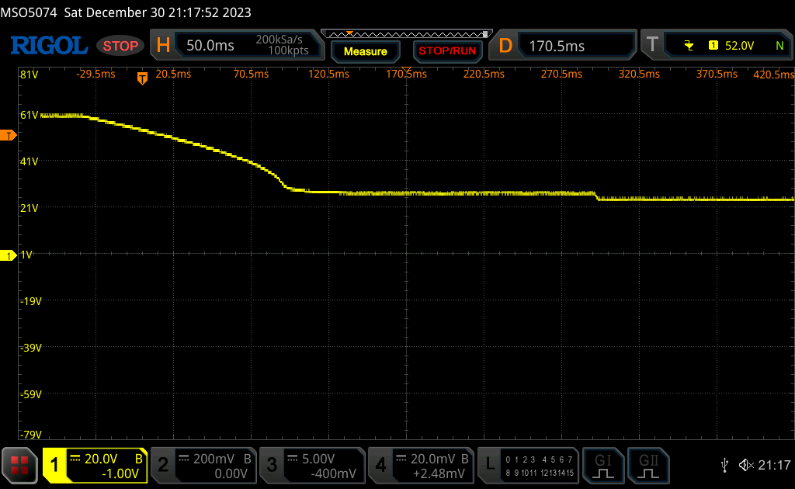

# Off-Line Smart RGB LED Panel
A constant current driver made to to drive 100W RGB COB LEDs straight from mains power

[Interactive BOM](https://htmlpreview.github.io/?https://github.com/wszeto9/Off-Line-Smart-RGBCCT-LED-Panel/blob/main/ibom.html)

## Testing and Validation

This is probably the most complicated board I've made so far! This isn't because it has more circuits or anything, but rather because it's powered off AC mains. I can't just plug it in and hope that it works. There's an insignificant chance it doesn't, and who knows what will happen to the circuit if a component doesn't work as expected. It goes without saying, don't try this at home! It's taken me years to feel okay designing a system like this, and it isn't a project to build on a whim. Nevertheless, let's look into the bringup process. 

### 24VDC Buck

One of the easiest things to test is the 24V Buck converter. Solder it up, and stick +50VDC (0.1A max) between +HV and -HV. It's safe enough for me to feel comfortable testing it alone. Flip the power switch, and the conviniently placed LED indicator turns on, suggesting that the power rail works. Sticking a multimeter on the power rail shows... ***25.5V***? Interesting. I wonder if it's because there's no load on it. I'll have to look at it again once I get some load put together. For now, it's fine. The 3.3V regulator doesn't care as long as it's below 28V, and the LED drivers are okay with up to a few hundred volts. The LNK3206 IC the design is based on also has a soft-start feature, and that seems to work great. Rise time seems to be ~ 16 ms, no overshoots or anything. Cool! 

*Soft-start of 24V rail. +HV = 60V DC*

### Bulk Capacitor Discharge Testing

Before I even consider plugging this into the wall, I need to ensure that the bulk capacitors are able to drain in a reasonable time after being unplugged. Bulk capacitors without bleed resistors are one of the scariest things to see. There's no telling whether it's at 400V or 0V simply by looking, and one slip up during measurement would be very dangerous. In this test, I'll inject +60VDC between +HV and -HV. Then I'll measure the voltage across C2. +60VDC is high enough that I can extrapolate discharge rate to +169VDC, while also being low enough that I'd be okay starting with it. 

*Schematic of Bleed Circuit, Rev A02*

*Voltage across C2 after +HV is turned off. Initial discharge rate seems to be approximately 20V/100ms, or 200V/s*

Looking at the discharge rate, it seems to be much higher than expected. The calculations show a 15 second time-constant from a 1M/15.5uF system. The measured time constant is much less than 1 second. This might be since the Buck converter is attached to the circuit, which has ~ 10k of load at 24V. Assuming 100% efficiency, that would equate to ~ 24k of load at 60V, and it's also a psudo-constant power load since the buck converter wants to keep the output at 24V. With a 24k / 15.5uF system, that gets a tau of 0.36 seconds, fairly close to what's observed. The constant power load also explain why the discharge rate seems to accelerate when the capacitor voltage gets closer to 25V.